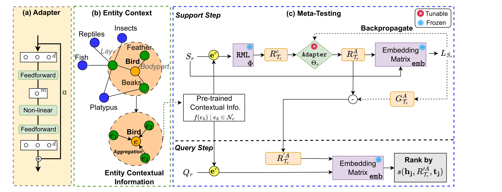
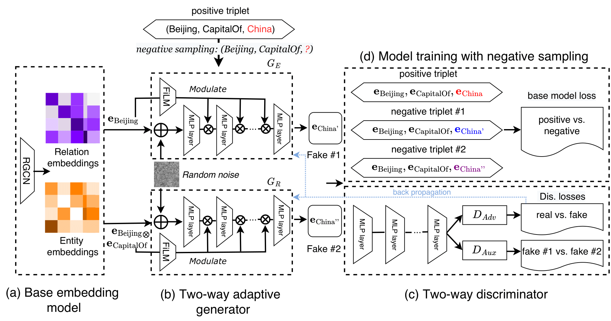








I am currently pursuing a PhD in the School of Computer Science and Information Systems at Singapore Management University (SMU), since 2021. My research is supervised by Prof. [Fang Yuan](https://www.yfang.site/curriculum-vitae) and co-supervised by Prof. [Xiaoli Li](https://personal.ntu.edu.sg/xlli/), affiliated with the Institute for Infocomm Research at A*Star, Singapore. Prior to my doctoral studies, I obtained a Master’s degree in Analytics from Nanyang Technological University (NTU) in 2020.

My research focuses on machine learning for Knowledge Graphs, with particular emphasis on multimodal learning, few-shot relation learning, and meta-learning. I am deeply interested in leveraging advanced methods to improve knowledge representation and reasoning in graph-based models. Additionally, I explore the use of Large Language Models (LLMs) such as BERT, Lama, and other state-of-the-art models to enhance machine understanding and reasoning capabilities.
Feel free to contact me by <a href="mailto:liuran_998@hotmail.com">email</a> if you are interested in discussing or collaborating with me.
 
It has been attented  times.

<!--
 -->
<!-- Views:  times -->
<!--Visitors:  -->
<!-- *2024.12*: &nbsp; I will visit Singapore as a visiting postgraduate research student between 2024 and 2025.-->
<!--
 🎉 -->
<!--I have published several papers on explainability in international conferences and journals. Additionally, I participated in a competition focused on interpretability, achieving the honor of winning the national first prize (champion) in China.  -->
<!--- *2024.08*: &nbsp; We attend the 2024 Annual Conference of the Association for Computational Linguistics in Bangkok, Thailand.-->

# 🔥 News 
- *2025.03*: &nbsp; One paper on diversified negative sampling is accepted in workshop [GDMA2025](https://gdma2025.github.io/). 
- *2024.11*: &nbsp; We share our conference paper during the poster presentation in [EMNLP2024](https://emnlp2024-main-conference.paperform.co/). 
- *2024.05*: &nbsp; One paper on meta-learning is accepted in [EMNLP2024](https://emnlp2024-main-conference.paperform.co/). 

# 📝 Selected Publications 

EMNLP 2024

[Context-Aware Adapter Tuning for Few-Shot Relation Learning in Knowledge Graphs](https://github.com/liuran998/RelAdapter)

Liu Ran, Zhongzhou Liu, Xiaoli Li, Yuan Fang.

- Knowledge graphs (KGs) are instrumental in various real-world applications, yet they often suffer from incompleteness due to missing relations. To predict instances for novel relations with limited training examples, few-shot relation learning approaches have emerged, utilizing techniques such as meta-learning. However, the assumption is that novel relations in meta-testing and base relations in meta-training are independently and identically distributed, which may not hold in practice. To address the limitation, we propose RelAdapter, a context-aware adapter for few-shot relation learning in KGs designed to enhance the adaptation process in meta-learning. 

GDMA 2025

[Diversified and Adaptive Negative Sampling on Knowledge Graphs](https://github.com/liuran998/DANS)

Ran Liu, Zhongzhou Liu, Xiaoli Li, Hao Wu, Yuan Fang.

- In knowledge graph embedding, aside from positive triplets (i.e., facts in
the knowledge graph), the negative triplets used for training also have a di-
rect influence on the model performance. In reality, since knowledge graphs
are sparse and incomplete, negative triplets often lack explicit labels, and
thus they are often obtained from various sampling strategies (e.g., ran-
domly replacing an entity in a positive triplet). An ideal sampled negative
triplet should be informative enough to help the model train better. However,
existing methods often ignore diversity and adaptiveness in their sampling
process, which harms the informativeness of negative triplets. As such, we
propose a generative adversarial approach called Diversified and Adaptive
Negative Sampling (DANS) on knowledge graphs. 

Under review - ARR 2025 

A paper on Few-Shot Relation Learning in Multimodal Knowledge Graphs

# 🎖 Honors and Awards
- *2021.01* A STAR Graduate Scholar. 

# 📖 Educations
- *2021.01 - 2025.05 (now)*, School of Computer and Information Technology, Singapore Management University. Ph.D. Student.
- *2019.05 - 2020.06*, School of Physical and Mathematical Sciences, Nanyang Technological University. MSc in Analytics.

# 💬 Invited Talks
- *2024.11*, We shared our [paper](https://github.com/liuran998/RelAdapter) during the poster presentation in EMNLP2024 (Miami,Florida)

# 💻 Work Experience
- *2021.1 - 2025 (Present)*, A*STAR Institute for Infocomm Research I²R (Industry Attachment). 
- *2019.1 - 2020.06*, Micron Singapore, Data engineering (Internship).

<!-- 

-->

<!-- Default Statcounter code for My personal site  

<noscript>

</noscript>
 End of Statcounter Code -->
